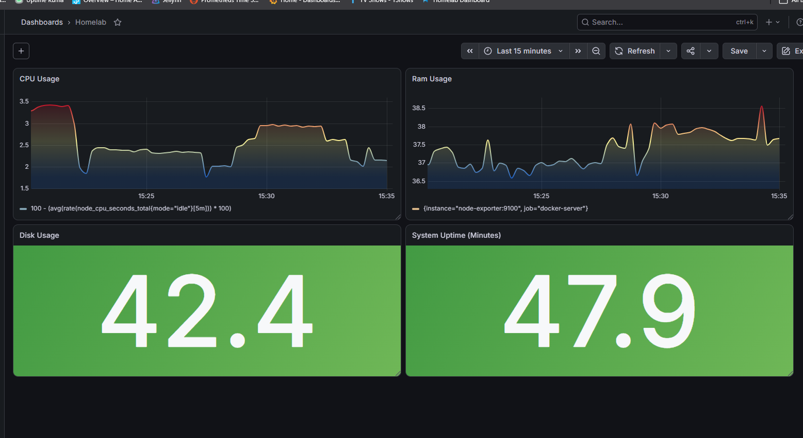
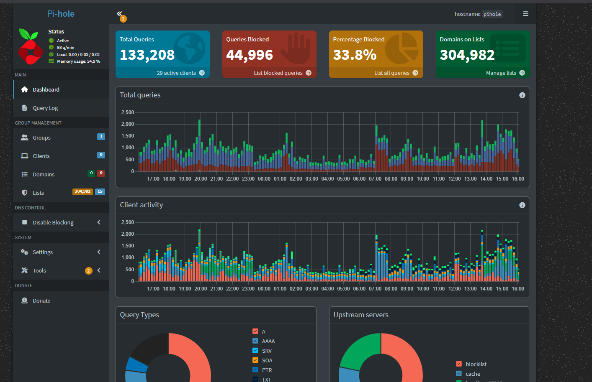
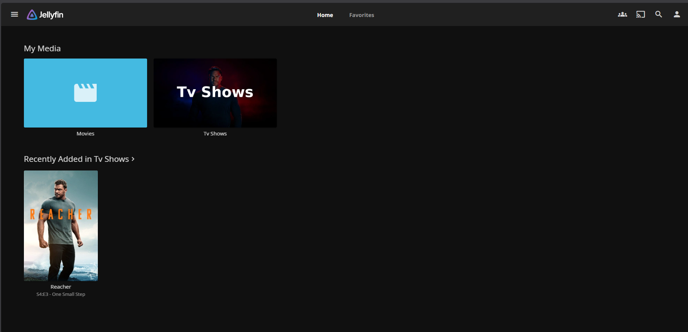

# Proxmox Homelab

Self-hosted infrastructure lab built on Proxmox VE for virtualization, containerization, infrastructure automation, reverse proxying, DNS, monitoring, observability, media streaming, and home automation.

The environment combines virtual machines, Docker Compose, Ansible, Prometheus/Grafana monitoring, service availability alerting, internal DNS, and locally trusted HTTPS.


## Architecture

```text
                              Home Network
                                   |
                  +----------------+----------------+
                  |                                 |
             Raspberry Pi                       Proxmox VE
                  |                                 |
               Pi-hole                    +---------+---------+
          DNS / Local DNS                 |                   |
                                   Home Assistant VM     Ubuntu Server VM
                                                               |
                                                             Docker
                                                               |
                 +-------------+-------------+-----------------+-------------+
                 |             |             |                 |             |
              Jellyfin    Uptime Kuma     Grafana         Prometheus      Homepage
                                |                              |
                         Discord Alerts                  Node Exporter
                 |             |             |                 |             |
                 +-------------+-------------+-----------------+-------------+
                                               |
                                      Nginx Proxy Manager
                                               |
                                  Reverse Proxy / TLS
                                               |
                                          *.home.arpa
```

## Hardware

### Proxmox Host

- Intel Celeron N5095
- 4 CPU cores
- 12 GB DDR4 RAM
- 512 GB SSD
- Proxmox VE

### Raspberry Pi

Dedicated Raspberry Pi running Pi-hole for network DNS services and filtering.

## Virtualization

### Home Assistant VM

Dedicated Home Assistant OS virtual machine.

- 2 vCPU
- 4 GB RAM
- 32 GB storage
- Smart-home device management and automation

### Ubuntu Docker Server

Ubuntu Server VM hosting the containerized application and monitoring stack.

- 4 vCPU
- 4 GB RAM
- 200 GB virtual disk
- Docker
- Docker Compose

## Containerized Services

### Nginx Proxy Manager

Provides a reverse-proxy layer in front of internal web services.

Instead of accessing applications through raw IP addresses and ports, services are available through internal DNS names such as:

```text
grafana.home.arpa
uptime.home.arpa
jellyfin.home.arpa
prometheus.home.arpa
```

Nginx Proxy Manager provides:

- Reverse proxy routing
- Centralized TLS termination
- HTTP-to-HTTPS redirection
- HTTP/2 support
- Consistent internal service naming

A wildcard certificate for `*.home.arpa` is issued using a private mkcert Certificate Authority and deployed through Nginx Proxy Manager.

Certificate private keys and CA material are intentionally excluded from this repository.

### Jellyfin

Self-hosted media server for organizing and streaming locally stored media.

### Uptime Kuma

Service availability monitoring for:

- Pi-hole
- Home Assistant
- Jellyfin
- Prometheus
- Grafana
- Node Exporter

Status-change alerts are delivered through Discord notifications.

### Prometheus

Collects time-series infrastructure metrics from Node Exporter.

Collected metrics include:

- CPU utilization
- Memory utilization
- Disk utilization
- Network throughput
- System uptime

### Grafana

Visualizes Prometheus metrics through a custom infrastructure monitoring dashboard.

Dashboard panels include:

- CPU utilization
- RAM utilization
- Disk utilization
- System uptime
- Network traffic

### Node Exporter

Exports Linux host and operating-system metrics from the Ubuntu Docker server for collection by Prometheus.

### Homepage

Centralized dashboard providing a single interface for homelab services and infrastructure information.

### Pi-hole

Dedicated Raspberry Pi providing network-wide DNS filtering, local DNS resolution, and ad blocking.

Pi-hole also provides internal DNS records for the `*.home.arpa` services routed through Nginx Proxy Manager.

### Home Assistant

Virtualized smart-home management platform integrating supported IoT devices and home automation services.

## Reverse Proxy and TLS Architecture

```text
Client
   |
   | DNS query
   v
Pi-hole
   |
   | resolves *.home.arpa
   v
Nginx Proxy Manager
   |
   | HTTPS / TLS termination
   |
   +----------+----------+----------+----------+
   |          |          |          |          |
 Grafana    Uptime    Jellyfin   Prometheus  Homepage
```

This provides HTTPS and human-readable internal hostnames without exposing administrative services directly to the public Internet.

## Monitoring Architecture

```text
Ubuntu Server
     |
     v
Node Exporter :9100
     |
     v
Prometheus
     |
     | PromQL
     v
Grafana
     |
     v
Infrastructure Dashboard


Uptime Kuma
     |
     +-- Pi-hole
     +-- Home Assistant
     +-- Jellyfin
     +-- Prometheus
     +-- Grafana
     +-- Node Exporter
     |
     v
Discord Alerts
```

This separates infrastructure metrics and visualization from availability monitoring and alerting.

## Infrastructure Automation

Container deployment is automated with Ansible rather than requiring each Docker Compose stack to be deployed manually.

The Ansible configuration contains:

```text
ansible/
├── inventory.ini
├── site.yml
└── files/
```

The playbook:

- Connects to the Ubuntu Docker server over SSH
- Ensures required deployment directories exist
- Copies Docker Compose configuration to the server
- Deploys containerized services
- Provides a repeatable infrastructure deployment workflow

The stack can be deployed with:

```bash
ansible-playbook -i ansible/inventory.ini ansible/site.yml
```

This makes service deployment reproducible rather than dependent on manual host configuration.

## Networking

Internal DNS is provided by Pi-hole.

Application traffic follows:

```text
Client
   |
   v
Pi-hole DNS
   |
   v
Nginx Proxy Manager
   |
   v
Docker Service
```

Internal services use the reserved `home.arpa` namespace.

Administrative services are not intentionally exposed directly to the public Internet.

## Security

The homelab uses several layers to reduce unnecessary exposure:

- Services remain on the private LAN
- Pi-hole provides internal DNS resolution
- Nginx Proxy Manager centralizes application access
- HTTP services are redirected to HTTPS
- TLS certificates are issued by a private local CA
- Administrative applications are not directly exposed to the Internet
- Sensitive application data is excluded from source control

The following are intentionally **not committed**:

- Passwords
- API keys
- Private keys
- TLS private certificates
- mkcert CA private keys
- `.env` files containing secrets
- Nginx Proxy Manager databases
- Nginx Proxy Manager persistent runtime data
- Jellyfin media
- Application databases
- Persistent container data

## Technologies

### Virtualization & Infrastructure

- Proxmox VE
- Linux
- Ubuntu Server
- Virtual Machines
- SSH

### Containers & Automation

- Docker
- Docker Compose
- Ansible
- Infrastructure as Code

### Networking & Security

- Nginx Proxy Manager
- Pi-hole
- DNS
- Reverse Proxying
- TLS/HTTPS
- mkcert
- TCP/IP

### Monitoring & Observability

- Prometheus
- Grafana
- Node Exporter
- Uptime Kuma
- PromQL
- Discord Alerting

### Applications

- Home Assistant
- Jellyfin
- Homepage

## Repository Structure

```text
homelab/
├── README.md
├── .gitignore
│
├── ansible/
│   ├── inventory.ini
│   ├── site.yml
│   └── files/
│
├── docker/
│   ├── homepage/
│   │   ├── compose.yaml
│   │   ├── services.yaml
│   │   └── widgets.yaml
│   │
│   ├── jellyfin/
│   │   └── compose.yaml
│   │
│   ├── monitoring/
│   │   ├── compose.yaml
│   │   └── prometheus.yml
│   │
│   ├── nginx-proxy-manager/
│   │   └── compose.yaml
│   │
│   └── uptime-kuma/
│       └── compose.yaml
│
└── screenshots/
    ├── Homelab Dashboard.png
    ├── Grafana.png
    ├── Uptime Kuma.png
    ├── Pi-hole.png
    ├── Home Assistant.png
    └── Jellyfin.png
```

## Screenshots

### Homepage Dashboard


### Grafana



### Uptime Kuma


### Pi-hole



### Home Assistant


### Jellyfin



## Future Improvements

- Automated configuration validation and testing
- Automated backups and tested disaster recovery
- Additional Prometheus exporters and Grafana dashboards
- Kubernetes/K3s learning environment
- Argo CD
- GitOps-based deployment workflow
